# 🏗️ DeAI Platform Architecture

## Table of Contents
- [System Overview](#system-overview)
- [Component Architecture](#component-architecture)
- [Data Flow](#data-flow)
- [Smart Contract Architecture](#smart-contract-architecture)
- [API Design](#api-design)
- [Security Architecture](#security-architecture)
- [Scalability Design](#scalability-design)
- [Deployment Architecture](#deployment-architecture)

## System Overview

DeAI is built as a modern, distributed system leveraging microservices architecture with blockchain integration. The platform is designed for high availability, scalability, and security.

### Key Architectural Principles

- **Microservices Architecture**: Modular, loosely coupled services
- **Event-Driven Design**: Asynchronous communication via message queues
- **Horizontal Scalability**: Auto-scaling based on demand
- **Fault Tolerance**: Graceful degradation and self-healing
- **Zero-Trust Security**: Every request verified and authenticated

## Component Architecture

### 🌐 Frontend Layer

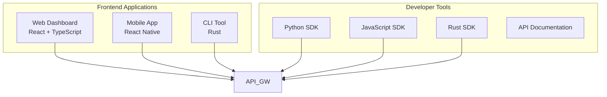

### ⚙️ Backend Services

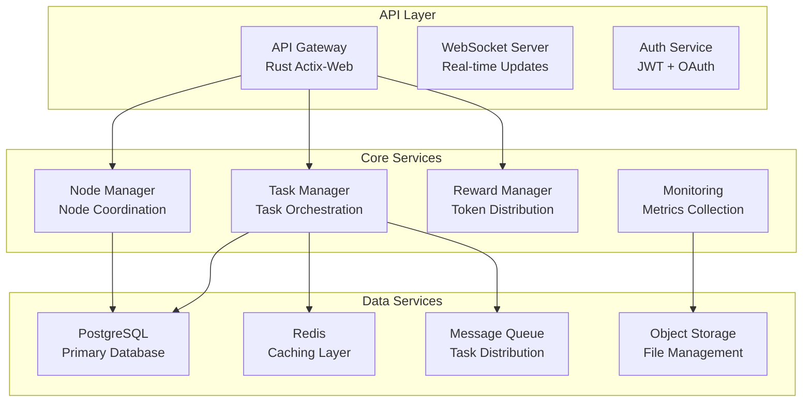

### 🔗 Blockchain Layer

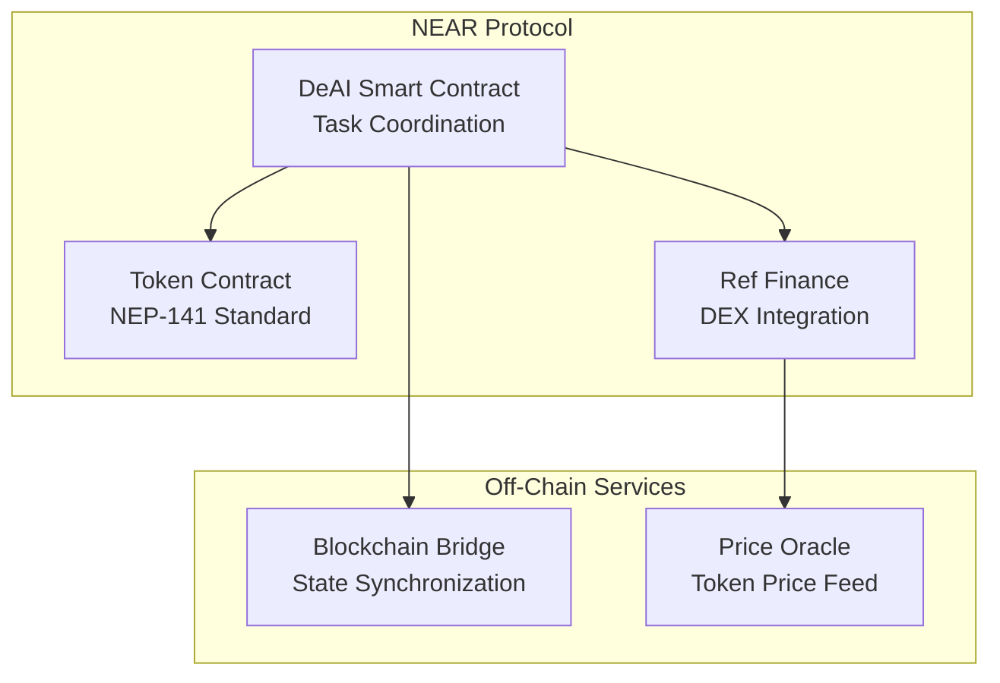

## Data Flow

### Task Execution Flow

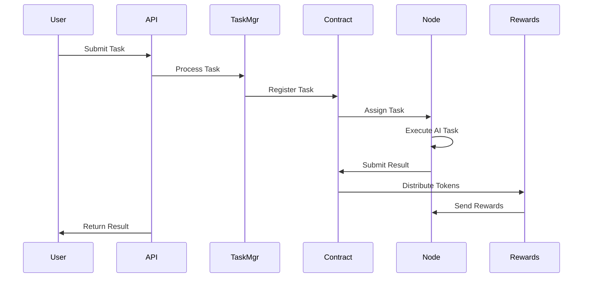

### Node Registration Flow

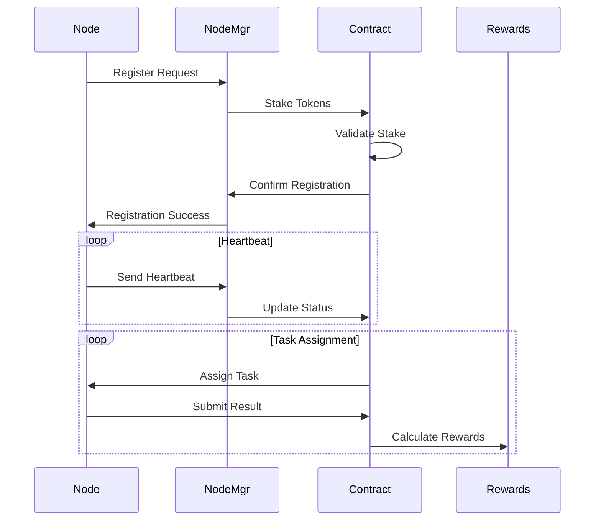

## Smart Contract Architecture

### Contract Structure

```rust
pub struct DeAICompute {
    // Node management
    pub nodes: HashMap<AccountId, NodeInfo>,
    
    // Task management  
    pub tasks: VecDeque<Task>,
    pub completed_tasks: HashMap<u64, Task>,
    pub task_counter: u64,
    
    // Token economics
    pub token: FungibleToken,
    pub total_rewards_distributed: Balance,
    
    // Configuration
    pub min_stake: NearToken,
    pub owner_id: AccountId,
}
```

### Key Functions

| Function | Purpose | Gas Limit |
|----------|---------|-----------|
| `register_node` | Node registration with stake | 50 TGas |
| `submit_task` | Task submission by users | 30 TGas |
| `submit_result` | Result submission by nodes | 100 TGas |
| `heartbeat` | Node status update | 10 TGas |
| `ft_transfer` | Token transfers | 20 TGas |

### State Management

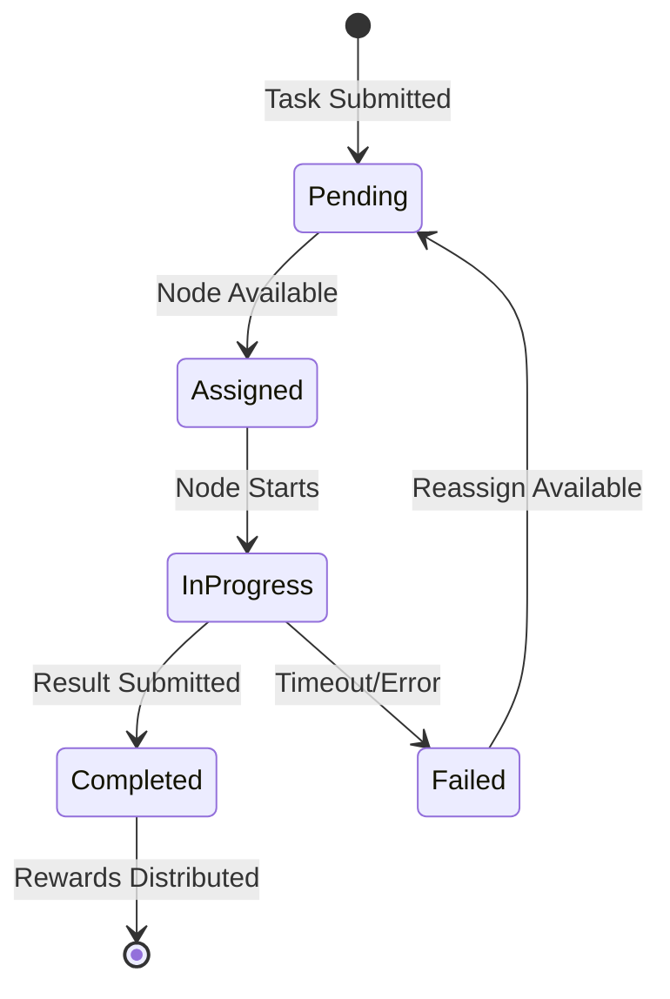

## API Design

### RESTful API Structure

```
/api/v1/
├── auth/
│   ├── login
│   ├── register
│   └── refresh
├── tasks/
│   ├── {id}
│   ├── submit
│   └── cancel
├── nodes/
│   ├── register
│   ├── {id}/status
│   └── stats
├── user/
│   ├── profile
│   ├── api-keys
│   └── billing
└── network/
    ├── stats
    └── health
```

### WebSocket Events

```json
{
  "task_update": {
    "task_id": "string",
    "status": "pending|assigned|completed|failed",
    "progress": "number",
    "estimated_completion": "timestamp"
  },
  "node_status": {
    "node_id": "string",
    "status": "online|offline|maintenance",
    "performance_metrics": "object"
  },
  "network_stats": {
    "active_nodes": "number",
    "pending_tasks": "number",
    "throughput": "number"
  }
}
```

## Security Architecture

### Defense in Depth

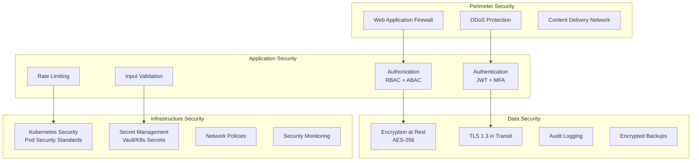

### Authentication Flow

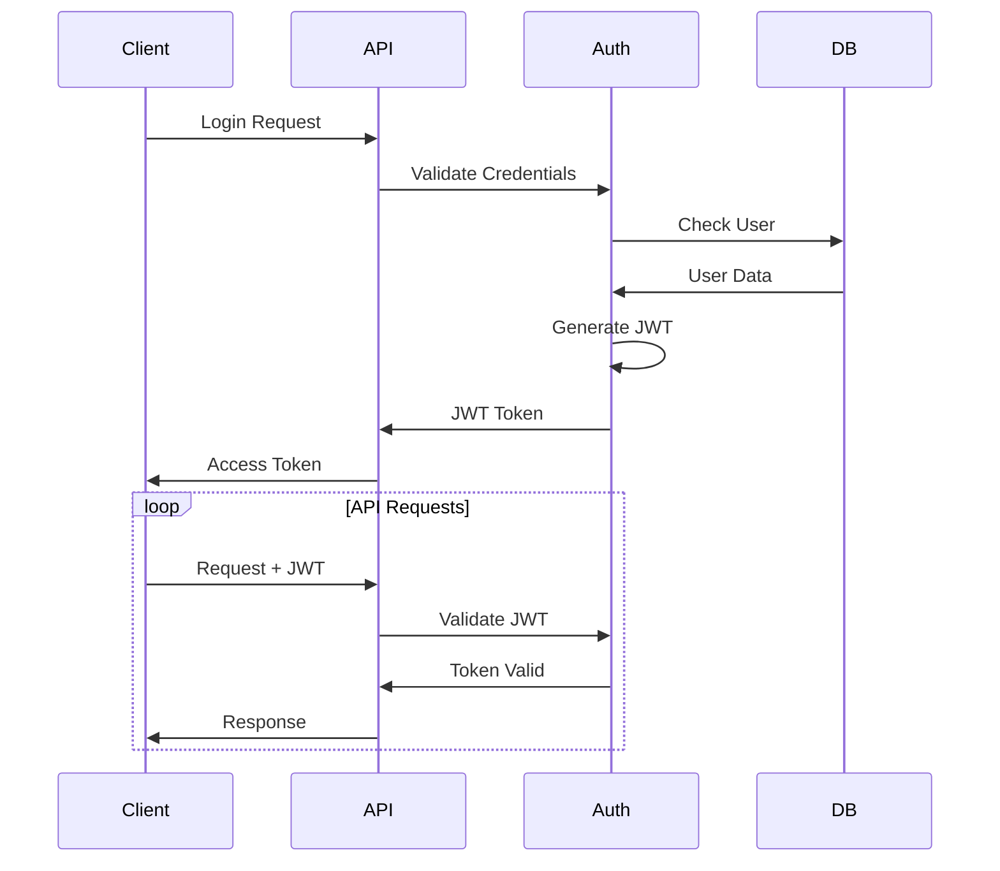

## Scalability Design

### Horizontal Scaling

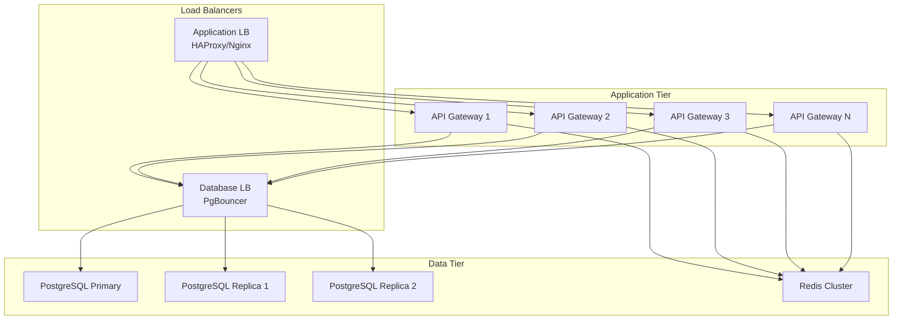

### Auto-Scaling Policies

| Metric | Scale Up Threshold | Scale Down Threshold | Min/Max Instances |
|--------|-------------------|---------------------|-------------------|
| CPU Utilization | >70% for 5 min | <30% for 10 min | 2/20 |
| Memory Usage | >80% for 3 min | <40% for 10 min | 2/20 |
| Request Rate | >1000 RPS | <200 RPS | 2/50 |
| Queue Length | >100 tasks | <10 tasks | 1/10 |

### Performance Targets

| Component | Metric | Target | SLA |
|-----------|--------|--------|-----|
| API Gateway | Response Time | <200ms P95 | 99.9% |
| Task Processing | Throughput | >4000 TPS | 99.5% |
| Node Assignment | Latency | <5 seconds | 99% |
| Database | Query Time | <50ms P95 | 99.9% |
| WebSocket | Connection Time | <1 second | 99% |

## Deployment Architecture

### Kubernetes Architecture

```yaml
# Production deployment overview
apiVersion: v1
kind: Namespace
metadata:
  name: deai-production

---
# API Gateway Deployment
apiVersion: apps/v1
kind: Deployment
metadata:
  name: api-gateway
spec:
  replicas: 3
  strategy:
    type: RollingUpdate
    rollingUpdate:
      maxSurge: 1
      maxUnavailable: 0
  template:
    spec:
      containers:
      - name: api-gateway
        image: deai/api-gateway:latest
        resources:
          requests:
            memory: "512Mi"
            cpu: "500m"
          limits:
            memory: "1Gi"
            cpu: "1000m"
        livenessProbe:
          httpGet:
            path: /health
            port: 8080
          initialDelaySeconds: 30
          periodSeconds: 10
        readinessProbe:
          httpGet:
            path: /ready
            port: 8080
          initialDelaySeconds: 5
          periodSeconds: 5
```

### Multi-Region Deployment

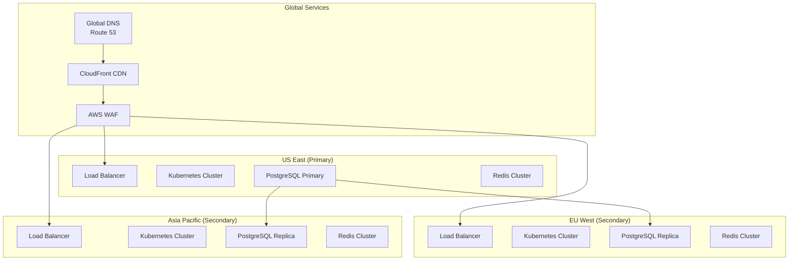

### Disaster Recovery

| RTO (Recovery Time Objective) | RPO (Recovery Point Objective) | Strategy |
|--------------------------------|--------------------------------|----------|
| **Critical Services**: 15 minutes | **Critical Data**: 1 minute | Active-Active with auto-failover |
| **Standard Services**: 1 hour | **Standard Data**: 15 minutes | Active-Passive with monitoring |
| **Non-Critical**: 4 hours | **Analytics Data**: 1 hour | Backup restore with manual intervention |

## Performance Optimization

### Caching Strategy

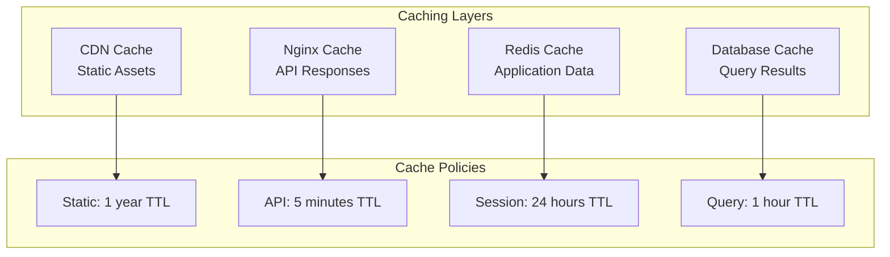

### Database Optimization

- **Read Replicas**: 3 replicas for read scaling
- **Connection Pooling**: PgBouncer with 100 connections per instance
- **Query Optimization**: Automatic query analysis and index recommendations
- **Partitioning**: Time-based partitioning for large tables
- **Archival**: Automated data archival for historical data

### Monitoring and Observability

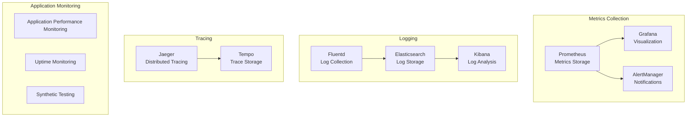

This architecture is designed to support:

- **500+ concurrent nodes**
- **4000+ TPS coordination**
- **99.9% uptime SLA**
- **Global scalability**
- **Enterprise security**

The modular design allows for independent scaling and updating of components while maintaining high availability and performance.